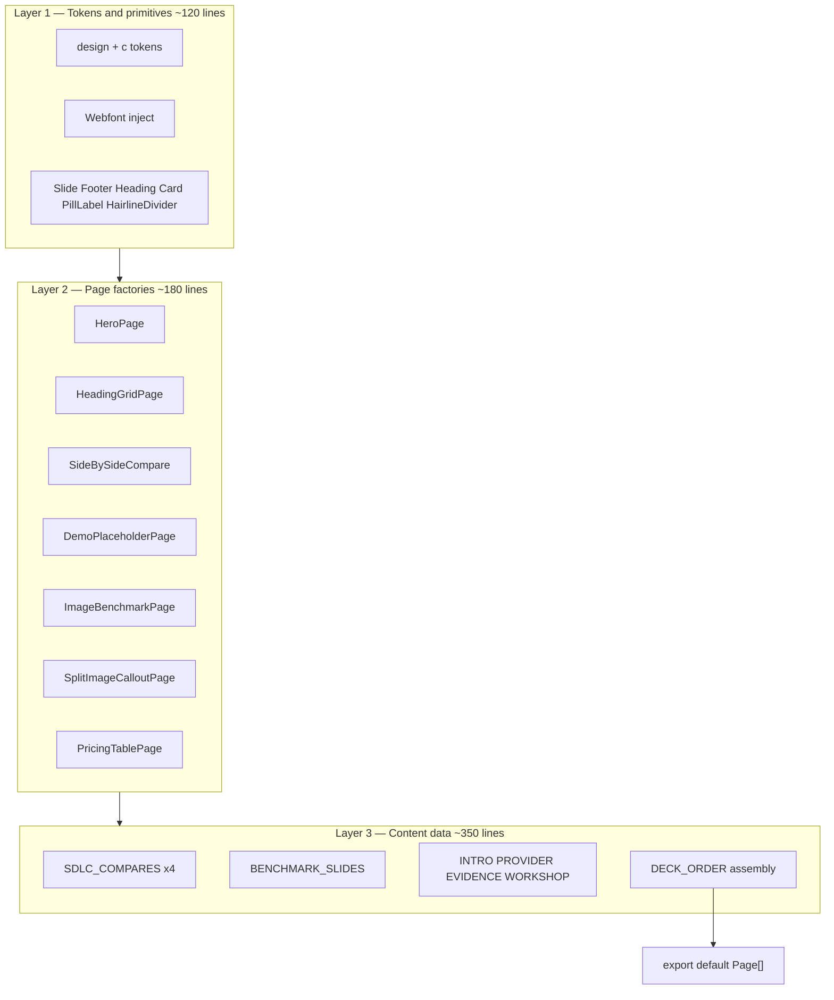

# Astra SDLC `index.tsx` Architecture Plan (≤700 lines)

## Content source of truth

**All deck copy, page order, grilling decisions, comparison text, and slide-level specs live in:**

[`.cursor/plans/astra_sdlc_slide_rewrite_17323c06.plan.md`](astra_sdlc_slide_rewrite_17323c06.plan.md)

This architecture plan covers **how** to implement that content in code. Do not duplicate the 27-page copy here — read the content plan for headlines, bullets, tables, and presenter notes.

## User Story

As a slide maintainer, I want `slides/astra-sdlc/index.tsx` to stay **≤700 lines** with reusable page factories and typed content constants, so that implementing the 27-page deck from the content plan does not require duplicating layout JSX across the file.

## Current State

| Metric | Value |
|--------|-------|
| File | [`slides/astra-sdlc/index.tsx`](slides/astra-sdlc/index.tsx) |
| Lines | **734** (`wc -l`) |
| Pages | **19** inline `const Foo: Page = () => (...)` components |
| Target | **27 pages**, **≤700 lines** |
| Constraint | [`slide-authoring` skill](.agents/skills/slide-authoring/SKILL.md): one `index.tsx` + `assets/` only — no sibling files |

**Naive approach risk:** Adding 8 pages as bespoke components → ~1,000–1,200 lines.

## Architecture — 3-Layer Data-Driven Single File

Replace "one bespoke `Page` component per slide" with three layers inside `index.tsx`:



### Line budget (hard cap)

| Section | Target lines | Responsibility |
|---------|-------------|----------------|
| Imports, `design`, tokens, webfont | ~50 | Editorial palette + Plus Jakarta / Inter |
| Layout primitives (Layer 1) | ~120 | `Slide`, `Footer`, `Heading`, `Card`, pills, dividers |
| Page factories (Layer 2) | ~180 | Generic renderers — **no page-specific copy** |
| Content constants (Layer 3) | ~330 | All 27 pages as typed data objects |
| Assembly + `meta` + export | ~20 | `DECK_ORDER` → `Page[]` |
| **Total** | **≤700** | Verify with `wc -l slides/astra-sdlc/index.tsx` |

**Overflow policy:** Trim data verbosity first. Never add a new bespoke `const SomePage: Page`. If a layout is genuinely novel, add a factory — not a one-off page component.

### Layer 1 — Tokens and primitives

Apply editorial tokens from the content plan (`design.md` mapping). Responsibilities:

- `export const design: DesignSystem` — eggshell bg, ink text
- Local `const c = { … }` mirroring CSS vars (taupe, stone, smoke, ash)
- Idempotent webfont `<link>` inject (Plus Jakarta 400/500/600, Inter, JetBrains Mono)
- Shared layout primitives used by all factories

**Delete from current file:** cyan grid overlay, heavy card shadows, colored uppercase badges.

**Consolidate one-off helpers:** retire `CompareBlock`, `FlowNode`, `ScoreCell`, `PromptBox` — fold behavior into page factories.

**Replace per-page components:** 19 individual `const Foo: Page = () => (...)` blocks → ~9 factories + typed data constants.

### Layer 2 — Page factories

Build once; every page is a data record passed to a factory:

| Factory | Pages (see content plan #) | Key props |
|---------|---------------------------|-----------|
| `HeroPage` | Cover (1), Closing (27) | `kicker`, `title`, `subtitle`, `aside?`, `source` |
| `HeadingGridPage` | Event Promise (2), Problem (3), Replace Definition (6), What We Compare (8), Model Candidates (12), Quality Rubric (14) | `kicker`, `title`, `cards[]`, `columns` |
| `FlowDiagramPage` | AstraFlow Provider (4), SDLC Map (15) | `steps[]`, `annotations?` |
| `SplitImageCalloutPage` | How We Win (7) | `image`, `headline`, `rows[]`, `source` |
| `ImageBenchmarkPage` | Intel-vs-Cost (9), Arena (10), Kimi (11) | `title`, `image`, `callouts[]`, `footerSource` |
| `PricingTablePage` | Cost Model (13) | `formula`, `rows[]`, `anchorNote` |
| `SideBySideCompare` | PRD (16), RFC (18), Code (20), Review (22) | `task`, `proprietary`, `openWeight`, `metrics`, `risk`, `source` |
| `DemoPlaceholderPage` | Demo PRD (17), Demo RFC (19), Demo Code (21), Demo Review (23) | `task`, `models`, `instruction`, `source` |
| `MatrixPage` | Routing Matrix (24), Scorecard (26) | `grid`, `headers`, `rows` |
| `HandsOnPage` | Hands-On Scenario (25) | `brief`, `prompts[]` |

Each factory returns `(): JSX.Element` satisfying `Page`. Factories call Layer 1 primitives only.

### Layer 3 — Content constants

Move all copy into typed records. Suggested groupings:

```tsx
const INTRO_PAGES = [ /* cover, promise, problem */ ];
const PROVIDER_PAGES = [ /* astraflow, thesis, replace, howWeWin */ ];
const EVIDENCE_PAGES = [ /* whatCompare, scatter, arena, kimi, cost, rubric */ ];
const SDLC_COMPARES = [ /* 4 task pairs + embedded demo config */ ];
const WORKSHOP_PAGES = [ /* sdlcMap, matrix, handsOn, scorecard, closing */ ];
```

Each data entry **≤15 lines**. Long tables use compact row arrays, not repeated JSX.

### SDLC_COMPARES + flatMap interleave

Define compare + demo as one record per SDLC task. Spread at export time so demo follows compare immediately (content plan grilling decision):

```tsx
type SdlcCompare = {
  id: 'prd' | 'rfc' | 'code' | 'review';
  task: string;
  proprietary: { model: string; strengths: string[] };
  openWeight: { model: string; strengths: string[] };
  risk: string;
  metrics: { label: string; value: string }[];
  demo: { instruction: string };
};

const SDLC_COMPARES: SdlcCompare[] = [
  { id: 'prd', task: 'PRD', proprietary: { model: 'GPT-5.5', strengths: [/* content plan */] }, /* … */ },
  // rfc, code, review — copy from content plan "Explicit comparison copy"
];

const createComparePage = (c: SdlcCompare): Page => () => <SideBySideCompare {...c} />;
const createDemoPage = (c: SdlcCompare): Page => () => (
  <DemoPlaceholderPage task={c.task} models={`${c.proprietary.model} vs ${c.openWeight.model}`} instruction={c.demo.instruction} />
);

// DECK_ORDER assembly (pages 16–23):
...SDLC_COMPARES.flatMap((c) => [createComparePage(c), createDemoPage(c)]),
```

**Exact model pairs** (data only — details in content plan):

| id | Proprietary | Open-weight |
|----|-------------|-------------|
| prd | GPT-5.5 | GLM 5.2 |
| rfc | Opus 4.8 | Kimi K2.7 |
| code | GPT-5.5 | Kimi K2.7 |
| review | Opus 4.8 | GLM 5.2 |

### DECK_ORDER assembly

Map 27 content-plan pages to factory + data refs:

```tsx
const DECK_ORDER: Page[] = [
  ...INTRO_PAGES.map(createIntroPage),
  ...PROVIDER_PAGES.map(createProviderPage),
  ...EVIDENCE_PAGES.map(createEvidencePage),
  createSdlcMapPage(SDLC_MAP),
  ...SDLC_COMPARES.flatMap((c) => [createComparePage(c), createDemoPage(c)]),
  ...WORKSHOP_PAGES.map(createWorkshopPage),
];

export default DECK_ORDER satisfies Page[];
```

Page order must match content plan table (pages 1–27).

## Image asset inventory (5 images)

Used by `SplitImageCalloutPage` and `ImageBenchmarkPage` factories. Source paths are Cursor workspace uploads; destinations are slide-local imports.

| # | Source (workspace) | Destination (import in index.tsx) | Factory | Page |
|---|-------------------|-----------------------------------|---------|------|
| 1 | `.cursor/projects/.../assets/image-211fee6c-fa35-484c-946a-b708ec60173b.png` | *(reference only — not embedded)* | — | Superseded by scatter; scores for data: Opus 4.8 ≈56, GPT-5.5 ≈55, GLM-5.2 ≈53, Kimi K2.6 ≈42 |
| 2 | `.cursor/projects/.../assets/image-01b8b6c5-6d21-4991-9912-c721847a909d.png` | `./assets/kimi-benchmarks.png` | `ImageBenchmarkPage` | 11 |
| 3 | `.cursor/projects/.../assets/image-b4bbc0a1-0012-4d7c-9c8b-13d7f744a54e.png` | `./assets/arena-agent-leaderboard.png` | `ImageBenchmarkPage` | 10 |
| 4 | `.cursor/projects/.../assets/image-c8c40d4f-c135-49e5-9471-26daf80e0274.png` | `./assets/intelligence-vs-cost.png` | `ImageBenchmarkPage` | 9 |
| 5 | `.cursor/projects/.../assets/Screenshot_2026-07-06_at_20.39.56-25bea26e-293b-420c-97ee-4ac72ccbc95d.png` | `./assets/stack-swap-win.png` | `SplitImageCalloutPage` | 7 |

**Import pattern:**

```tsx
import kimiBenchmarks from './assets/kimi-benchmarks.png';
import arenaLeaderboard from './assets/arena-agent-leaderboard.png';
import intelligenceVsCost from './assets/intelligence-vs-cost.png';
import stackSwapWin from './assets/stack-swap-win.png';
```

**Status:** Destinations 2–5 already copied to `slides/astra-sdlc/assets/`. Image #1 is reference-only for intelligence scores in scatter callout data.

## Kimi benchmark slide data spec (page 11)

Factory: `ImageBenchmarkPage`. Full narrative in content plan; data shape:

```tsx
const KIMI_BENCHMARK: BenchmarkSlide = {
  title: 'Coding & Agent Benchmarks',
  image: kimiBenchmarks,
  footerSource: 'Kimi vendor benchmark * · Jul 2026',
  callouts: [
    { label: 'Coding', items: ['Kimi Code Bench v2*', 'Program Bench', 'MLS Bench Lite'] },
    { label: 'Agents', items: ['Kimi Claw 24/7 Bench*', 'MCP Atlas', 'MCP Mark Verified'] },
  ],
  footnote: 'Chart shows K2.6; workshop compares K2.7 Code. Vendor internal benchmarks (*).',
  narrative: [
    'K2.7 within ~5–15pts of GPT-5.5 on coding benches',
    'MCP Atlas: K2.7 76 vs GPT-5.5 79.4',
    'MCP Mark Verified: K2.7 81.1 vs GPT-5.5 92.9',
  ],
};
```

Presenter note (content plan): Arena agent rank (#14) does not contradict stronger coding scores — pair with Kimi chart for task-specific story.

## Demo placeholder specs (pages 17, 19, 21, 23)

Factory: `DemoPlaceholderPage`. Minimal full-bleed layout for live screen-switch.

| Page | Title | Subtitle | Instruction |
|------|-------|----------|-------------|
| 17 | `Demo: PRD` | `GPT-5.5 vs GLM 5.2` | Switch to live IDE / AstraFlow console |
| 19 | `Demo: RFC` | `Opus 4.8 vs Kimi K2.7` | Switch to live IDE / AstraFlow console |
| 21 | `Demo: Code` | `GPT-5.5 vs Kimi K2.7` | Switch to live IDE / AstraFlow console |
| 23 | `Demo: Review` | `Opus 4.8 vs GLM 5.2` | Switch to live IDE / AstraFlow console |

**Layout rules:**

- Large centered title (96–120px Plus Jakarta)
- Single subtitle line (models + task)
- One instruction line in mono ash
- No dense content — must read in deck thumbnail
- Footer via `Slide` primitive + `useSlidePageNumber()`

Data lives inside each `SDLC_COMPARES[n].demo` record; factory reads props only.

## Phased implementation

### Phase 0 — Architecture scaffold

1. Rewrite Layer 1 tokens + primitives with `design.md` values
2. Implement Layer 2 factories (empty/default props first)
3. Migrate existing **19 pages** into Layer 3 data constants; wire `DECK_ORDER`
4. **Gate:** `wc -l slides/astra-sdlc/index.tsx` ≤ 700 with 19 pages before adding new content

### Phase 1 — New content via data only

1. Append 8 new page records (How We Win, What Compare, scatter, Arena, Kimi, 4 demos via `SDLC_COMPARES`)
2. Extend `DECK_ORDER` to **27 entries** — no new factory types unless layout is genuinely novel
3. Confirm image imports resolve to `./assets/*.png`

### Phase 2 — Polish + verify

1. Tighten copy in data constants (not factory code) — source: content plan
2. Verify vertical budget per page (840px usable with 120px padding)
3. Browser screenshot evidence (see Verification)

**No changes** to `package.json`, `open-slide.config.ts`, or other slides.

## Edge Cases

- **700-line overflow when adding copy** — trim data rows; split verbose copy across `subtitle` + `footnote` fields; never add bespoke `Page` components
- **Factory prop typing** — narrow TS types (`SdlcCompare`, `BenchmarkSlide`, `GridCard`) so missing fields fail compile
- **Long comparison bullets** — enforce one-line strings in data; factory wraps consistently at 32–36px
- **grep navigation after refactor** — locate pages via `grep "id: 'prd'" slides/astra-sdlc/index.tsx` in data constants, not `grep ": Page = "`
- **Benchmark staleness** — footer source strings live in data constants
- **Kimi K2.6 vs K2.7** — footnote in Kimi benchmark data
- **1080px overflow** — split into two data entries rather than shrinking factory typography
- **Image #1 reference** — do not embed bar chart; use scores in scatter callout data only

## Definition of Done

- [x] `wc -l slides/astra-sdlc/index.tsx` reports **≤700 lines** (520 lines)
- [x] No individual `const SomePage: Page = () => (...)` blocks — pages assembled from factories + data only
- [x] All **27 pages** present in `export default` via `DECK_ORDER` (order matches content plan)
- [x] `SDLC_COMPARES.flatMap` interleaves compare → demo for all 4 tasks
- [x] All 4 slide assets imported and rendered via factories (pages 7, 9, 10, 11)
- [x] Demo placeholders match spec table above
- [x] Kimi benchmark data includes 6 benchmarks, 2 categories, narrative scores, K2.6→K2.7 footnote
- [x] Every page fits 1080px height without scroll/crop
- [x] Footer page numbers use `useSlidePageNumber()` throughout (via `Slide` primitive)
- [x] Visual tokens match content plan (`design.md` editorial system)

Deck content correctness (copy, pricing, AstraFlow gateway details, comparison text) is verified against the **content plan**, not this file.

## Verification

1. **Line count:** `wc -l slides/astra-sdlc/index.tsx` — must be ≤700
2. **No bespoke pages:** `grep -c ': Page = ()' slides/astra-sdlc/index.tsx` — should be 0 (factories may use inline returns)
3. **Page count:** `grep -c "id:" slides/astra-sdlc/index.tsx` in `DECK_ORDER` / data — 27 entries
4. **Dev server:** `pnpm dev` from repo root → open `http://localhost:5173/s/astra-sdlc`
5. **Screenshot evidence** (browser verification required):
   - Cover (token application)
   - AstraFlow provider page
   - How We Win (stack-swap image)
   - Intelligence vs Cost scatter
   - Arena benchmark
   - Kimi benchmark
   - One SideBySideCompare (e.g. PRD)
   - One Demo placeholder
   - Cost Model pricing table
6. Navigate full deck — confirm **27 pages**, no vertical crop at 1920×1080
7. If visual result diverges from content plan / `design.md`, pause and ask whether to adjust
