# AstraFlow SDLC Slide Rewrite Plan

> **Implementation architecture (≤700 lines):** see [astra_sdlc_index_architecture_700.plan.md](astra_sdlc_index_architecture_700.plan.md)

## User Story

As a workshop presenter, I want the AstraFlow SDLC deck restyled with `design.md` tokens and clearer open-weight vs proprietary comparisons, so that the audience understands how to route models per task through AstraFlow and when to switch screens for live demos.

## Original Brief

From the initial workshop request ([transcript](3186f1aa-a791-4101-bfe7-1747876ad595)):

1. **Research AstraFlow** — position as Model Provider like OpenRouter using [ModelVerse Quick Start](https://astraflow.ucloud-global.com/en-us/docs/modelverse/modelverse/quick-start)
2. **Open-weight vs proprietary** — how to change or use open-weight instead of GPT-5.5 / Opus 4.8 as default proprietary models; use cheap but good models
3. **Side-by-side comparisons** with exact model pairs per SDLC task:
   - PRD: GPT-5.5 vs GLM 5.2
   - RFC: Opus 4.8 vs Kimi K2.7
   - Code generation: GPT-5.5 vs Kimi K2.7
   - Review: Opus 4.8 vs GLM 5.2
4. **What we compare** — cost, output quality, latency, benchmarks, and related workflow metrics

Additional requirements from brief:

- Enhance UI/UX using `design.md` color tokens and typography
- Polish wording, layout, and examples on existing pages
- Add **demo placeholder slides** with titles like "Demo: PRD (GPT-5.5 vs GLM 5.2)" — presenter switches to another screen for live AstraFlow/IDE demo
- Workshop event footer on cover: **"Stop Reading, Start Vibe-ing · UCloud Jakarta"**

## Current State

- **27 pages** assembled via data-driven factories in `slides/astra-sdlc/` (576 lines total across modules; `index.tsx` entry is 20 lines)
- **Module layout** for easier editing:
  - `index.tsx` — `design`, `meta`, export
  - `tokens.ts` / `primitives.tsx` / `factories.tsx` — editorial UI layer
  - `content/*.tsx` — page copy grouped by deck section
  - `deck.ts` — `DECK_ORDER` assembly (27 pages)
- Visual language: eggshell/taupe editorial tokens from `design.md`, Plus Jakarta display + Inter body
- Four benchmark assets in `slides/astra-sdlc/assets/` (stack-swap, scatter, Arena, Kimi)
- **Verified:** `pnpm build` passes; deck loads at `http://localhost:5173/s/astra-sdlc` with 27 pages

Gaps vs brief:

- Comparisons are generic "premium vs open-weight" — not the **specific model pairs** named above
- No "What we compare" slide (cost, output, latency, benchmarks)
- No benchmark reference visuals (scatter, Arena, Kimi, stack-swap)
- No demo placeholder slides
- AstraFlow section lacks OpenRouter-style positioning (OpenAI-compatible gateway, regional endpoints, model catalog)

## Code constraint (≤700 lines)

The rewrite of [`slides/astra-sdlc/index.tsx`](slides/astra-sdlc/index.tsx) must stay **≤700 lines** — currently **734 lines** with 19 bespoke page components; target is **27 pages** without overflow.

**Implementation approach:** data-driven page factories + typed content constants inside the single file (no sibling `components/` or `.ts` files). Full layer breakdown, line budget, factory table, and `SDLC_COMPARES.flatMap` interleave pattern → [astra_sdlc_index_architecture_700.plan.md](astra_sdlc_index_architecture_700.plan.md).

**Verify:** `wc -l slides/astra-sdlc/index.tsx` must report ≤700 before marking done.

## Grilling Session — Decisions Locked

| Question | Your answer | Plan impact |
|----------|-------------|-------------|
| Session length | **45–60 min** | 27 pages ≈ 1.5 min/slide + live demo time — tight; no page cuts requested |
| Model availability | **Confirmed** on AstraFlow; DeepSeek also in use | DeepSeek as cost-efficiency anchor on Cost Model slide |
| Demo placement | **After each task (task-based)** | Compare → Demo interleaved per task — **not grouped at end** |
| Typography | **Plus Jakarta Sans** display only | Replaces Inter 300 whisper headlines; Inter 400/500 body |
| Cost slide | **Real $/M token numbers** | Side-by-side pricing table from AstraFlow docs |
| Kimi chart | **`` embed as-is** | Dark PNG on eggshell canvas — accepted visual contrast |
| Benchmark credibility | **Show AA + Arena + Kimi with source labels** | Workshop rubric + live demo = final truth; charts set context only |
| DeepSeek role | **Cost-efficiency anchor** (also mentioned on Model Candidates) | DeepSeek V3/V4 anchors Cost Model slide |
| Page cuts | **None** | Keep all pages despite time pressure |
| **File size** | **≤700 lines** | Data-driven factories + content constants — see [architecture plan](astra_sdlc_index_architecture_700.plan.md) |

**Open risk (flagged, not blocking):** 27 slides + 4 live demos in 45–60 min requires ~1.3 min/slide average or skipping beats on stage. Presenter should mark optional pages (Model Candidates, Replace Definition) mentally.

## Design Direction — Apply `design.md` Tokens

Replace the current palette/components with an **ElevenLabs warm editorial** system mapped to slide canvas scale (1920×1080):

| Token | Value | Slide usage |
|-------|-------|-------------|
| `--color-eggshell` | `#fdfcfc` | Page canvas (`design.palette.bg`) |
| `--color-warm-taupe` | `#f5f3f1` | Feature cards, taupe bands |
| `--color-stone` | `#ebe8e4` | Hairline borders, dividers |
| `--color-ink` | `#000000` | Headlines, filled pills (`design.palette.text`) |
| `--color-smoke` / `--color-ash` | `#777169` / `#a59f97` | Body, captions, footer |
| `--color-violet-spark` / `--color-ember-orange` | `#0447ff` / `#ff4704` | **Product visuals only** — benchmark sphere accents, not UI chrome |

**Typography (slide-scaled — grilling override):**

- Display: **Plus Jakarta Sans** 400–600 at 96–120px headings, `-0.02em` tracking (projector-safe; replaces design.md Waldenburg/Inter 300)
- Body: Inter 400/500 at 32–40px, `+0.01em` tracking on captions (~22–26px on canvas)
- Mono: Geist Mono / JetBrains Mono for model IDs, API paths, pricing tables, footer

**Component library rewrite** (shared editorial components within `index.tsx`):

- Remove cyan grid overlay
- `FeatureCard` — taupe fill, 20px radius, 32px padding, no drop shadow
- `PillLabel` — stone border, ink text, 9999px radius (not colored uppercase badges)
- `HairlineDivider` — 1px `#ebe8e4`
- `SideBySideCompare` — proprietary vs open-weight columns with model name, task role, strengths, risks, and **metric strip** (intelligence index / relative cost tier)
- `FilledPill` / `OutlinePill` — black/eggshell per design.md button hierarchy
- Footer — whisper mono caption in ash, page numbers via `useSlidePageNumber()`

Update `export const design: DesignSystem` to eggshell/ink palette; keep extended tokens as local `const c = { … }` mirroring `design.md` CSS vars.

**Webfont:** Inject Plus Jakarta Sans 400/500/600 + Inter 400/500 + JetBrains Mono once at module top (idempotent `<link>` pattern from slide-authoring skill).

## Content Architecture — Revised 27-Page Flow

```mermaid
flowchart LR
  subgraph intro [Intro]
    Cover
    Promise
    Problem
  end
  subgraph provider [Provider]
    AstraFlow
    OpenWeight
    ReplaceDef
    HowWeWin
  end
  subgraph evidence [Evidence]
    WhatCompare
    IntelVsCost
    ArenaChart
    KimiChart
    CostModel
    Rubric
  end
  subgraph routing [Routing with interleaved demos]
    SdlcMap
    PrdCmp --> DemoPRD
    RfcCmp --> DemoRFC
    CodeCmp --> DemoCode
    ReviewCmp --> DemoReview
    Matrix
  end
  subgraph workshop [Workshop]
    HandsOn
    Scorecard
  end
  Closing
  intro --> provider --> evidence --> routing --> workshop --> Closing
```



### Evidence narrative arc

Presenter flow through the evidence block:

```
How We Win (task swaps) → What We Compare → Intelligence vs Cost (macro ROI)
        → Arena (agent) → Kimi chart (coding) → Cost Model (real $/M)
```

- **Page 7 (stack swap):** micro task-level proof — small benchmark gap, large cost gap
- **Page 9 (scatter):** macro ROI proof — move from expensive proprietary (top-right) toward high intel + low cost (top-left)
- **Pages 10–11 (Arena + Kimi):** independent + vendor benchmarks with source labels — audience judges; rubric decides
- **Page 13 (Cost Model):** real pricing closes the loop with DeepSeek anchor

### Page-by-page changes

| # | Page | Action |
|---|------|--------|
| 1 | **Cover** | Restyle; subtitle: "Route open-weight models through AstraFlow — not one premium default"; footer source: **"Stop Reading, Start Vibe-ing · UCloud Jakarta"** |
| 2 | **Event Promise** | Keep 3 pillars; tighten copy to workshop audience |
| 3 | **Problem** | Keep thesis; editorial `BigRule` on taupe band |
| 4 | **AstraFlow Provider** | **Expand** — OpenRouter-like MaaS gateway: OpenAI-compatible `/v1/chat/completions`, regional endpoints (`api-sg.umodelverse.ai` for SEA), swap model via `model` param only; flow: IDE/Agent → AstraFlow → model catalog → SDLC output |
| 5 | **Open-Weight Thesis** | Keep; refine wording |
| 6 | **Replace Definition** | Keep 3-card definition |
| 7 | **How We Win** | **NEW** — embed `stack-swap-win.png`; headline: small benchmark gap, large cost gap (see detailed spec below) |
| 8 | **What We Compare** | **NEW** — 2×3 grid: Cost per task, Output quality, Latency, Intelligence index, Arena rankings, Retry + human correction cost, **Vendor lock-in** |
| 9 | **Intelligence vs Cost** | **NEW** — embed AA scatter via ``; highlight top-left quadrant (see detailed spec below) |
| 10 | **Arena Benchmark** | Embed Arena Agent Leaderboard screenshot; GLM 5.2 #7 MIT beats GPT 5.5 base #10 |
| 11 | **Coding & Agent Benchmarks** | Embed Kimi chart via ``; footnote: vendor internal benchmarks (*) (see detailed spec below) |
| 12 | **Model Candidates** | 4 named models + DeepSeek mention + decision rule |
| 13 | **Cost Model** | Task cost formula + **real $/M token table**; **DeepSeek V3/V4 as cost-efficiency anchor** |
| 14 | **Quality Rubric** | Keep 6 criteria; footnote: **"Workshop rubric beats any benchmark chart"** |
| 15 | **SDLC Map** | Annotate pairs: PRD → GPT-5.5/GLM 5.2, RFC → Opus/Kimi K2.7, Code → GPT-5.5/Kimi K2.7, Review → Opus/GLM 5.2 |
| 16 | **PRD Comparison** | `SideBySideCompare`: GPT-5.5 vs GLM 5.2 |
| 17 | **Demo: PRD** | Live-switch placeholder (see demo spec below) |
| 18 | **RFC Comparison** | `SideBySideCompare`: Opus 4.8 vs Kimi K2.7 |
| 19 | **Demo: RFC** | Live-switch placeholder |
| 20 | **Code Comparison** | `SideBySideCompare`: GPT-5.5 vs Kimi K2.7 |
| 21 | **Demo: Code** | Live-switch placeholder |
| 22 | **Review Comparison** | `SideBySideCompare`: Opus 4.8 vs GLM 5.2 |
| 23 | **Demo: Review** | Live-switch placeholder |
| 24 | **Routing Matrix** | Keep 2×2 risk grid |
| 25 | **Hands-On Scenario** | Voucher brief + prompt boxes naming target models |
| 26 | **Scorecard** | Keep scoring grid |
| 27 | **Closing** | Restyle; same routing principle |

### Explicit comparison copy (per task)

**PRD — GPT-5.5 vs GLM 5.2**

- Premium: vague product problems, political scope, hidden assumptions
- Open: structured briefs with user/goal/scope/constraints/acceptance criteria
- Risk: shallow requirements, missed edge cases

**RFC — Opus 4.8 vs Kimi K2.7**

- Premium: ambiguous architecture, long context, second-order consequences
- Open: draft alternatives, risk lists, migration notes, decision tables (Kimi competitive on agent benchmarks per chart)
- Risk: weak constraints, generic tradeoffs, missing rollback

**Code — GPT-5.5 vs Kimi K2.7**

- Premium: unfamiliar codebases, multi-file context, complex deps
- Open: scoped implementation, tests, refactors; K2.7 within ~5–15pts of GPT-5.5 on coding benches
- Risk: fake APIs, incomplete integration

**Review — Opus 4.8 vs GLM 5.2**

- Premium: subtle reasoning, security-sensitive, behavioral regressions
- Open: checklist review, missing tests, pattern inconsistencies
- Risk: confident noise, missed deep design issues

### Demo placeholder slides (pages 17, 19, 21, 23)

User chose **task-based** demo slides (not model-named only). Minimal full-bleed layout — no grid clutter; must read clearly at thumbnail size.

| Page | Title | Subtitle | Footer source |
|------|-------|----------|---------------|
| 17 | `Demo: PRD (GPT-5.5 vs GLM 5.2)` | Switch to live IDE / AstraFlow console | Live demo · PRD task |
| 19 | `Demo: RFC (Opus 4.8 vs Kimi K2.7)` | Switch to live IDE / AstraFlow console | Live demo · RFC task |
| 21 | `Demo: Code (GPT-5.5 vs Kimi K2.7)` | Switch to live IDE / AstraFlow console | Live demo · Code task |
| 23 | `Demo: Review (Opus 4.8 vs GLM 5.2)` | Switch to live IDE / AstraFlow console | Live demo · Review task |

**Layout (demo placeholder slides):**

- Centered vertical stack on eggshell canvas
- `PillLabel` kicker: `live demo`
- Display title at 96–104px Plus Jakarta Sans
- Ash subtitle at 36–40px Inter
- Optional mono line: `model` param swap on AstraFlow — no other UI chrome

## Assets — Complete Inventory

All five user-supplied images. Source paths are under the Cursor project assets folder; slide paths under `slides/astra-sdlc/assets/`.

| # | Source (workspace) | Slide asset | Page | Usage |
|---|-------------------|-------------|------|-------|
| 1 | [`assets/image-211fee6c-fa35-484c-946a-b708ec60173b.png`](../../.cursor/projects/Users-naufaldi-satriya-WebApps-astra-sdlc/assets/image-211fee6c-fa35-484c-946a-b708ec60173b.png) | *(reference only — do not embed)* | — | Artificial Analysis **Intelligence Index bar chart**; superseded by scatter plot on page 9. Reference scores: Opus 4.8 **56**, GPT-5.5 **55**, GLM-5.2 **53**, Kimi K2.6 **42** |
| 2 | [`assets/image-01b8b6c5-6d21-4991-9912-c721847a909d.png`](assets/image-01b8b6c5-6d21-4991-9912-c721847a909d.png) | `slides/astra-sdlc/assets/kimi-benchmarks.png` | 11 | Kimi coding & agent benchmarks — `` embed as-is |
| 3 | [`assets/image-b4bbc0a1-0012-4d7c-9c8b-13d7f744a54e.png`](assets/image-b4bbc0a1-0012-4d7c-9c8b-13d7f744a54e.png) | `slides/astra-sdlc/assets/arena-agent-leaderboard.png` | 10 | Arena Agent Leaderboard — `` embed as-is |
| 4 | [`assets/image-c8c40d4f-c135-49e5-9471-26daf80e0274.png`](assets/image-c8c40d4f-c135-49e5-9471-26daf80e0274.png) | `slides/astra-sdlc/assets/intelligence-vs-cost.png` | 9 | Artificial Analysis scatter plot — `` embed as-is |
| 5 | [`assets/Screenshot_2026-07-06_at_20.39.56-25bea26e-293b-420c-97ee-4ac72ccbc95d.png`](assets/Screenshot_2026-07-06_at_20.39.56-25bea26e-293b-420c-97ee-4ac72ccbc95d.png) | `slides/astra-sdlc/assets/stack-swap-win.png` | 7 | Stack-swap win reference frame — `` embed as-is |

**Implementation status:** Assets 2–5 already copied to `slides/astra-sdlc/assets/` during an aborted implementation run. Re-copy if missing; do not re-copy if present.

All four embedded images render via `` on eggshell canvas (accepted visual contrast with dark benchmark PNGs).

### How We Win slide (page 7) — stack swap reference

**Slide title:** `The win: small benchmark gap, large cost gap`

**Layout:** Left ~45% — embed `stack-swap-win.png`; Right ~55% — taupe callout card mapping **workshop SDLC pairs** to the reference pattern (not a literal copy of all 6 swaps in the image):

| Workshop task | Swap (proprietary → open) | Reference pattern | Talking point |
|---------------|---------------------------|-------------------|---------------|
| RFC / reasoning | Opus 4.8 → Kimi K2.7 | ~8% benchmark gap, ~11× cheaper | Same pair as reference "Reasoning / Backend Brain" |
| PRD / agent drafting | GPT-5.5 → GLM 5.2 | ~3% gap, ~5× cheaper (agent loops ref) | GLM strong on Arena agent leaderboard |
| Code generation | GPT-5.5 → Kimi K2.7 | ~5–18% gap depending on bench, ~7× cheaper | Reference uses Qwen 3.7 — workshop uses Kimi; cite Kimi coding chart (page 11) |
| Code review | Opus 4.8 → GLM 5.2 | checklist + reasoning tradeoff | Emphasize human review stays in loop |

**Headline rule (from reference):** `87% cost reduction` is the *pattern* — do not claim exact workshop savings without live measurement; frame as "same revenue, lower inference spend when the task bar is met."

**Footer:** Reference frame · adapt pairs per SDLC task · verify on scorecard

### Intelligence vs Cost slide (page 9) — Artificial Analysis scatter

**Slide title:** `Intelligence vs cost per task`

**Layout:** Heading + full-width scatter image + 3 callout pills pointing to key dots:

| Model | Intelligence index | Cost/task (approx) | Win narrative |
|-------|-------------------|-------------------|---------------|
| Claude Opus 4.8 (max) | ~56 | ~$2.50 | Premium ceiling — high intel, high cost |
| GPT-5.5 (xhigh) | ~55 | ~$1.20 | Workshop proprietary baseline |
| **GLM-5.2 (max)** | **~51** | **~$0.45** | ~93% of GPT intel, **>60% cost cut** — top-left move |
| DeepSeek V4 Pro (max) | ~44 | ~$0.045 | DeepSeek cost anchor — extreme value zone |
| Kimi K2.6 | ~43 | ~$0.30 | Footnote: workshop uses K2.7 Code |

**Visual annotation:** Draw attention to green "Most Attractive Quadrant" (intel >45, cost <$0.30) — open-weight models cluster nearer top-left vs proprietary top-right.

**Footer source:** `artificialanalysis.ai · Intelligence vs Cost · Jul 2026`

**Pairs with page 7:** Scatter = macro proof; stack swap = micro task-level proof; together answer "how do we win?"

**Note on image #1:** The AA Intelligence Index bar chart (`image-211fee6c`) was the original reference; page 9 uses the scatter plot instead. Bar-chart scores remain useful for copy cross-check only.

### Arena Benchmark slide (page 10) — content from supplied image

**Slide title:** `Benchmark: Arena.ai Agent Leaderboard`

**Layout:** Heading + full-width image (~1680×780 within 120px padding) + optional taupe callout strip below with highlight bullets:

| Model | Rank | License | Key metric | Narrative for deck |
|-------|------|---------|------------|-------------------|
| Claude Opus 4.8 (Thinking) | #2 | Proprietary | +9.37% net improvement | Premium agent baseline |
| GPT 5.5 (xHigh) | #3 | Proprietary | +8.21% net improvement | Premium coding/product baseline |
| **GLM 5.2 (Max)** | **#7** | **MIT (open-weight)** | **+9.13% confirmed success** — beats GPT 5.5 base (#10, +4.07%) | Open-weight competitive on agent tasks |
| GPT 5.5 (base) | #10 | Proprietary | +6.22% net improvement | Shows tier matters within same family |
| Kimi K2.7 Code | #14 | Modified MIT | -0.77% net improvement | Weaker on *agent* leaderboard — pair with Kimi coding chart (page 11) for task-specific story |

**Footer source:** `arena.ai/leaderboard/agent · Jul 2026`

**Presenter note:** Arena measures *agentic* tasks; Kimi's lower rank here does not contradict its stronger coding bench scores — use with Kimi chart (page 11) and scatter plot (page 9).

### Kimi Benchmark slide (page 11) — content from supplied image

**Slide title:** `Coding & Agent Benchmarks`

**Layout:** Heading + full-width `` + taupe footnote strip

**Chart structure:** 6 benchmarks in 2 categories comparing Kimi K2.7 Code, Kimi K2.6, GPT-5.5 (xhigh), Opus 4.8 (xhigh):

| Category | Benchmark | K2.7 | K2.6 | GPT-5.5 | Opus 4.8 |
|----------|-----------|------|------|---------|----------|
| **Coding** | Kimi Code Bench v2* | 62.0 | 50.9 | 69.0 | 67.4 |
| **Coding** | Program Bench | 53.6 | 48.3 | 69.1 | 63.8 |
| **Coding** | MLS Bench Lite | 35.1 | 26.7 | 35.5 | 42.8 |
| **Agents** | Kimi Claw 24/7 Bench* | 46.9 | 42.9 | 52.8 | 50.4 |
| **Agents** | MCP Atlas | 76.0 | 69.4 | 79.4 | 81.3 |
| **Agents** | MCP Mark Verified | 81.1 | 72.8 | 92.9 | 76.4 |

**Key narrative for deck:**

- K2.7 within **~5–15 points** of GPT-5.5 on coding benchmarks (e.g. Kimi Code Bench: 62 vs 69)
- K2.7 competitive on MCP Atlas (76.0 vs 79.4) and MCP Mark Verified (81.1 vs 92.9)
- K2.7 **beats Opus 4.8** on MCP Mark Verified (81.1 vs 76.4) — supports Code task routing argument

**Footnotes:**

- `*` = vendor internal benchmarks — not independent; workshop rubric is final arbiter
- Chart includes K2.6 bars; workshop compares **K2.7 Code** — call out in footnote

**Footer source:** `Kimi vendor benchmark * · verify on workshop scorecard`

## AstraFlow Research Summary (for slide copy)

From [ModelVerse Quick Start](https://astraflow.ucloud-global.com/en-us/docs/modelverse/modelverse/quick-start):

- **Role:** UCloud ModelVerse / AstraFlow = neutral MaaS provider layer (like OpenRouter)
- **Compatibility:** OpenAI API standard — `/v1/chat/completions`, `/v1/models`, `/v1/response`
- **Integration:** Change `base_url` + `model` only; works with OpenAI SDK, curl, LangChain
- **Regions:** CN, Singapore, US, Frankfurt endpoints (`api-sg.umodelverse.ai` for SEA)
- **Models:** Catalog via `GET /v1/models` — includes DeepSeek, Qwen, Kimi, GPT, etc.
- **Pricing:** Per-million-token postpaid ([pricing docs](https://astraflow.ucloud.cn/docs/modelverse/price)) — show **real numbers on Cost Model slide**:
  - DeepSeek V3.2-Exp: ~2 CNY/M in, 3 CNY/M out (cost anchor)
  - Kimi K2: ~4 CNY/M in, 16 CNY/M out
  - GLM 5.2 / premium models: fetch live from docs at implementation time
  - GPT-5.5 / Opus 4.8: list direct API pricing for contrast even if routed via AstraFlow

## Implementation Approach

Content-focused rewrite of [`slides/astra-sdlc/index.tsx`](slides/astra-sdlc/index.tsx). Code structure (factories, data constants, line budget) is defined in the [architecture plan](astra_sdlc_index_architecture_700.plan.md).

- **How:** follow [astra_sdlc_index_architecture_700.plan.md](astra_sdlc_index_architecture_700.plan.md) for 3-layer scaffold, factory table, `SDLC_COMPARES.flatMap`, and phased `wc -l` gates

### Phase 0 — Design tokens and components

1. Apply `design.md` palette and Plus Jakarta / Inter typography
2. Build editorial component set (`FeatureCard`, `PillLabel`, `HairlineDivider`, `SideBySideCompare`, etc.)
3. Restyle existing 19 pages to new visual system

### Phase 1 — New pages and content

4. Add How We Win, What We Compare, Intelligence vs Cost, Arena, Kimi benchmark pages
5. Add 4 task comparison pages with exact model pairs; interleave demo placeholder after each compare
6. Verify/copy four benchmark assets to `slides/astra-sdlc/assets/` (already present from partial run)

### Phase 2 — Copy polish and verify

7. Tighten copy on problem, thesis, hands-on, scorecard, closing
8. Verify vertical budget per page (840px usable with 120px padding)
9. Run `wc -l slides/astra-sdlc/index.tsx` — must be ≤700
10. Browser screenshot evidence (see Verification)

**No changes** to `package.json`, `open-slide.config.ts`, or other slides.

## Edge Cases

- **700-line overflow when adding copy** — trim data row verbosity first; never add a new bespoke `Page` component; see [architecture plan](astra_sdlc_index_architecture_700.plan.md) overflow policy
- **Long comparison text wrapping** — enforce one-line bullets at 32–36px; split overflow to subtitle line
- **Demo slides in thumbnails** — fixed large title + single subtitle; must read at small size
- **Benchmark data staleness** — footer source notes: `artificialanalysis.ai · Jul 2026`, `arena.ai/leaderboard/agent · Jul 2026`, `Kimi vendor benchmark *`, `verify live pricing at workshop`
- **Benchmark credibility** — show AA + Arena + Kimi with source labels; explicitly state on Quality Rubric slide that workshop rubric + live demo output is the decision arbiter
- **Win narrative honesty** — 87% / 11× figures from stack-swap reference are illustrative; workshop scorecard validates real savings
- **Reference vs workshop pairs** — stack image uses Qwen 3.7 for code; workshop uses Kimi K2.7 — callout must acknowledge and point to Kimi chart (page 11)
- **Four benchmark visuals** — scatter (macro ROI), stack swap (task pattern), Arena (agent), Kimi (coding); rubric + live demo = final truth
- **Arena vs Kimi chart tension** — GLM 5.2 strong on Arena agent (#7); Kimi K2.7 weaker on Arena (#14) but competitive on Kimi coding chart — frame as task-specific routing
- **27 pages in 45–60 min** — presenter may skip Model Candidates or Replace Definition under time pressure
- **Kimi K2.6 vs K2.7** — both scatter and Kimi chart show K2.6; footnotes clarify workshop compares K2.7 Code
- **AA bar chart vs scatter** — `image-211fee6c` is reference only; page 9 uses scatter embed, not inline bar chart
- **Violet/orange accent rule** — only inside benchmark visual callouts, never on buttons/labels
- **1080px overflow** — if a page overflows, split content across subtitle + footnote rather than shrinking typography; Quality Rubric + BigRule currently tight

## Definition of Done

- [x] Total slide code **≤700 lines** across modules (576 lines; `index.tsx` entry 20 lines)
- [x] All 27 pages present in deck export
- [x] All pages use eggshell/taupe/stone palette; Plus Jakarta Sans display + Inter body typography
- [x] No cyan grid, no heavy card shadows, pill labels match editorial system
- [x] Cover footer shows "Stop Reading, Start Vibe-ing · UCloud Jakarta"
- [x] AstraFlow page explains OpenAI-compatible gateway + regional endpoints + model swap pattern
- [x] "What We Compare" page covers cost, output, latency, benchmarks, retry cost, **vendor lock-in**
- [x] How We Win slide embeds stack-swap reference + workshop SDLC pair callouts
- [x] Intelligence vs Cost scatter embedded via ``; Arena + Kimi benchmarks embedded via ``
- [x] Kimi benchmark slide documents 6 benchmarks with vendor (*) footnote and K2.7 clarification
- [x] Cost Model shows real $/M token numbers with DeepSeek as cost-efficiency anchor
- [x] Four task comparison pages name exact model pairs; each followed immediately by demo placeholder with task-based title + live-switch subtitle
- [x] Every page fits 1080px height without scroll/crop
- [x] Footer page numbers use `useSlidePageNumber()` throughout (via `Slide` primitive)

## Verification

1. Run `wc -l slides/astra-sdlc/index.tsx` — must be **≤700**
2. Run `pnpm dev` from repo root
3. Open `http://localhost:5173/s/astra-sdlc`
4. Screenshot evidence required for:
   - Cover page (design token application + event footer)
   - AstraFlow provider page
   - What We Compare page
   - How We Win page (stack swap reference)
   - Intelligence vs Cost scatter page
   - Arena benchmark page
   - Kimi benchmark asset page
   - One SideBySideCompare page (e.g. PRD)
   - One Demo placeholder page (e.g. Demo: PRD)
   - Cost Model page (real pricing table)
5. Navigate full deck — confirm **27 pages**, no vertical crop, readable at 1920×1080
6. If visual result diverges from editorial intent in `design.md`, pause and ask whether to adjust
